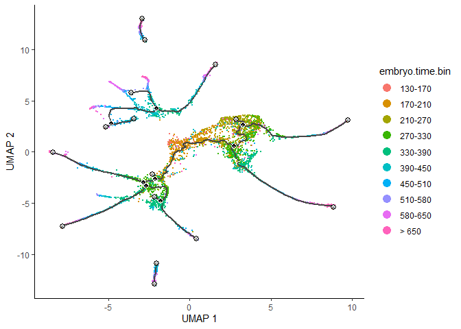

Constructing Single-Cell Trajectories
================
Matthew Esqueda
2024-02-07

## Load the data

``` r
expression_matrix <- readRDS(url("https://depts.washington.edu:/trapnell-lab/software/monocle3/celegans/data/packer_embryo_expression.rds"))
cell_metadata <- readRDS(url("https://depts.washington.edu:/trapnell-lab/software/monocle3/celegans/data/packer_embryo_colData.rds"))
gene_annotation <- readRDS(url("https://depts.washington.edu:/trapnell-lab/software/monocle3/celegans/data/packer_embryo_rowData.rds"))

cds <- new_cell_data_set(expression_matrix,
                         cell_metadata = cell_metadata,
                         gene_metadata = gene_annotation)
```

## Pre-process the data

This works the same as in clustering analysis, this time using a
different strategy for batch correction.

``` r
cds <- preprocess_cds(cds, num_dim = 50)
cds <- align_cds(cds, alignment_group = "batch", residual_model_formula_str = "~ bg.300.loading + bg.400.loading + bg.500.1.loading + bg.500.2.loading + bg.r17.loading + bg.b01.loading + bg.b02.loading")                     
```

In addition to using the `alignment_group` arg to `align_cds()`, which
aligns groups of cells (i.e. batches), also using
`residual_model_formual_str`, for subtracting continuous effects. Each
of the cols `bg.300.loading`, `bg.400.loading`, corresponds to a
background signal that a cell might be contaminated with. Passing these
cols as terms in the `residual_model_formuala_str` tells `align_cds()`
to subtract these signals prior to dimensionality reduction, clustering,
and trajectory inference.

## Reduce dimensionality and visualize the results

Use UMAP for dimensionality reduction (default method).

``` r
cds <- reduce_dimension(cds)
plot_cells(cds, label_groups_by_cluster = FALSE, color_cells_by = "cell.type")
```

<!-- -->

Use `plot_cells()` to visualize how individual genes vary along the
trajectory. Look at some genes with interesting patterns of expression
in ciliated neurons.

``` r
ciliated_genes <- c("che-1",
                    "hlh-17",
                    "nhr-6",
                    "dmd-6",
                    "ceh-36",
                    "ham-1")

plot_cells(cds,
           genes = ciliated_genes,
           label_cell_groups = FALSE,
           show_trajectory_graph = FALSE)
```

<!-- -->

## Cluster the cells

Monocle is able to learn when cells should be placed in the same
trajecotry as opposed to seperate trajectories through its clustering
procedure. With `cluster_cells()`, each cell is assigned not only to a
cluster but also to a partition. When learning trajectories, each
partition will eventually become a separate trajectory.

``` r
cds <- cluster_cells(cds)
plot_cells(cds, color_cells_by = "partition")
```

<!-- -->

## Learn the Trajectory Graph

Fit a principal graph within each partition using `learn_graph()`.

``` r
cds <- learn_graph(cds)
```

    ##   |                                                                              |                                                                      |   0%  |                                                                              |======================================================================| 100%

``` r
plot_cells(cds,
           color_cells_by = "cell.type",
           label_groups_by_cluster = FALSE,
           label_leaves = FALSE,
           label_branch_points = FALSE)
```

<!-- -->

This graph will be used in many downstream steps, such as branch
analysis and differential expression.

## Order the cells in pseudotime

Once the graph has been learned, order the cells according to their
progress through the developmental program, measuring this progress in
pseudotime.

In order to place the cells in order, tell Monocle where the “beginning”
of the biological process is. Choose regions of the graph marked as
“roots” of the trajectory. In time series experiments, this can usually
be accomplished by finding spots in the UMAP space that are occupied by
cells from early time points.

``` r
plot_cells(cds,
           color_cells_by = "embryo.time.bin",
           label_cell_groups = FALSE,
           label_leaves = TRUE,
           label_branch_points = TRUE,
           graph_label_size = 1.5)
```

<!-- -->

The black lines show the structure of the graph. The graph is not fully
connected: cells in different partitions are in distinct components of
the graph.Circles with numbers in them denote special points within the
graph. Each leaf, denoted by light gray circles, corresponds to
different outcomes (cell fates) of the trajectory. Black circles
indicate branch nodes, in which cells can travel to one of several
outcomes. Control whether or not these are shown with `label_leaves` and
`label_branch_points` args to `plot_cells`

`order_cells` will calculate where each cell falls in pseudotime. In
order to do so `order_cells()` needs to have root nodes of the
trajectory graph specified.

## Choose root nodes

``` r
# this will not work in interactive mode, either root_pr_nodes or root_cells must be provide
# helper function below provides work around example
# cds <- order_cells(cds)
```

In this example, just one location was chosen. Plotting the cells and
coloring them by pseudotime shows how they were ordered.

``` r
# see helper function below for working example
# plot_cells(cds,
#            color_cells_by = "pseudotime",
#            label_cell_groups = FALSE,
#            label_leaves = FALSE,
#            label_branch_points = FALSE,
#            graph_label_size = 1.5)
```

Some of the cells are gray, meaning they have infinite pseudotime,
because they were not reachable from the root nodes that were picked.
Any cell on a partition that lacks a root node will be assigned an
infinite pseudotime. In general, choose at least one root per partition.

The helper function below selects the root of a trajectory by first
grouping the cells according to which trajectory graph node they are
nearest to, then calculating what fraction of the cells at each node
come from the earliest time point. It then picks the node that is most
heavily occupied by early cells and returns that as the root.

``` r
# a helper function to identify the root principal points
get_earliest_principal_node <- function(cds, time_bin="130-170"){
  cell_ids <- which(colData(cds)[, "embryo.time.bin"] == time_bin)
  
  closest_vertex <- cds@principal_graph_aux[["UMAP"]]$pr_graph_cell_proj_closest_vertex
  closest_vertex <- as.matrix(closest_vertex[colnames(cds), ])
  root_pr_nodes <-igraph::V(principal_graph(cds)[["UMAP"]])$name[as.numeric(names
                  (which.max(table(closest_vertex[cell_ids,]))))]
  
  root_pr_nodes
}

cds <- order_cells(cds, root_pr_nodes = get_earliest_principal_node(cds))
```

Passing the programatically selected root node to `order_cells()` via
the `root_pr_node` arg.

``` r
plot_cells(cds,
           color_cells_by = "pseudotime",
           label_cell_groups = FALSE,
           label_leaves = FALSE,
           label_branch_points = FALSE,
           graph_label_size = 1.5,
           label_principal_points = TRUE)
```

<!-- -->

This could be done on a per-partition basis by first grouping the cells
by partition using `partitions()`. This would result in all cells being
assigned a finite pseudotime.

## Subset cells by branch

It is often to subset cells based in their branch in the trajectory. The
function `choose_graph_segments` allows you to do so interactively.

``` r
# interactive mode not working
cds_sub <- choose_graph_segments(cds,
                                 starting_pr_node = "Y_118",
                                 ending_pr_nodes = "Y_139")
```

## Working with 3D trajectories

``` r
cds_3d <- reduce_dimension(cds, max_components = 3)
cds_3d <- cluster_cells(cds_3d)
cds_3d <- learn_graph(cds_3d)
```

    ##   |                                                                              |                                                                      |   0%  |                                                                              |======================================================================| 100%

``` r
cds_3d <- order_cells(cds_3d, root_pr_nodes = get_earliest_principal_node(cds))

cds_3d_plot_obj <- plot_cells_3d(cds_3d, color_cells_by = "partition")
```
